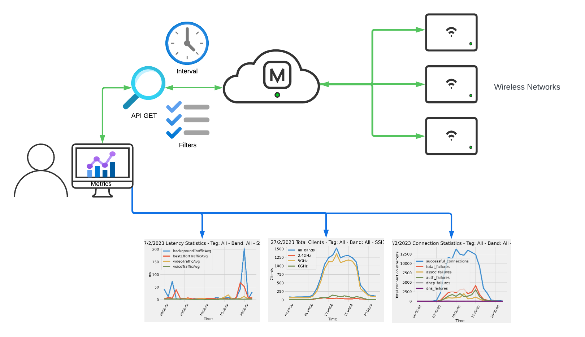
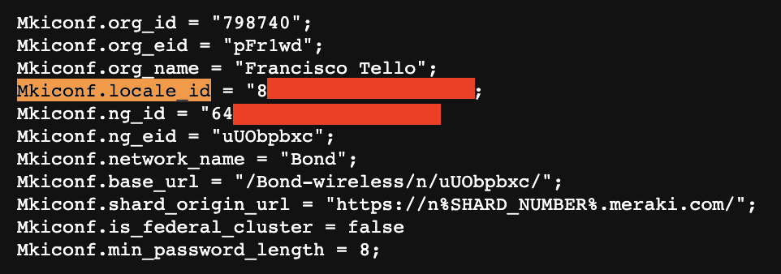
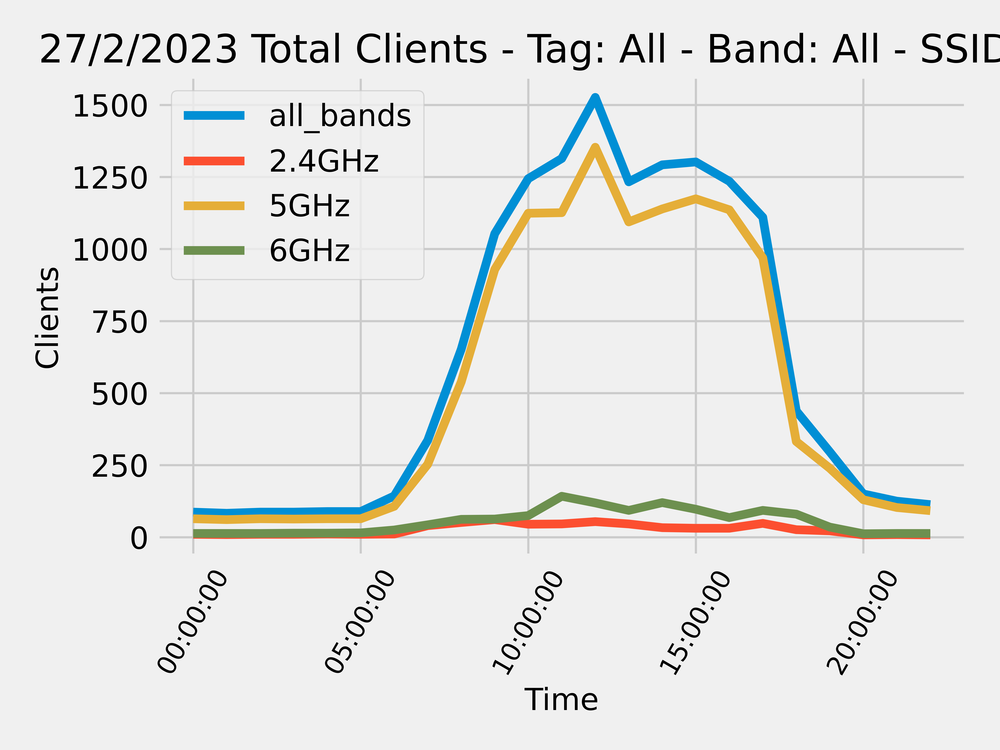

# merakiWifiAnalytics
Fetch client counts, connectivity stats and latency stats for a Meraki Wireless network over a period of time

# Table of Contents

[Introduction](#intro)

[Prerequisites](#prereq)

[How to Use](#howtouse)

# Introduction

This tool allows fetching wireless network statistics over a period of time, and outputs them in Matplotlib graphs and CSV files. The supported stats are:
* Client counts
* Connectivity stats (success and failures, as well as failure reasons)
* Latency stats

The script also supports filtering on SSID name, band (2.4, 5 and 6) and AP Tags.

## Prerequisites

1. Active Cisco Meraki subscriptions in the orgs where the script will be run
2. API access enabled for these organizations, as well as an API Key with access to them. See how to enable [here](https://documentation.meraki.com/General_Administration/Other_Topics/Cisco_Meraki_Dashboard_API)
3. A working Python 3.0 environment
4. Install libraries in `requirements.txt`
5. A working wireless network
6. Run the script

## How to Use

1. Clone repo to your working directory with `git clone https://github.com/Francisco-1088/merakiRadiusObjects.git`
2. Edit `config.py`
* Add your API Key under `API_KEY` in line 1
* Add the Network ID of the network where you want to operate under `net_id`. You can find your Network ID easily by right clicking anywhere in the screen while logged in to your organization, and clicking "View Page Source". In the resulting page use "Find" to look for the keyword `Mkiconf.locale_id` if your network is a combined network (has wireless plus any other products), or `Mkiconf.ng_id` if your network is a standalone wireless network.

* Under `year`, `month` and `day` set your target start date. Maximum lookback is 30 days.
* Under `step` specify the number of seconds at which each measurement will be taken (for example, if set to 3600, you will have a datapoint every 3600 seconds). Supported values are 300, 600, 1200, 3600, 14400 and 86400 seconds.
* Under `num_days` specify the look forward period from the start date for which stats will be fetched. Fractional values are supported. The maximum supported is 7 days.
* Optionally, specify an `ap_tag` if you only want stats for APs with a specific tag
* Optionally, specify a `band` (accepts 2.4, 5 and 5 as values, in string format) if you only want stats for a specific band
* Optionally, specify a `ssid` name if you only want stats for a specific SSID
* The specified names must match exactly the names of these SSIDs and tags in Dashboard
3. Run script with `python main.py`
4. The script will output a set of `.csv` files for every statistic collected, as well as graphs in `.png` format for every statistic

